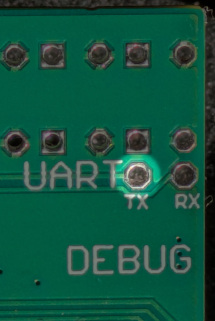
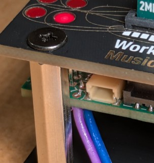
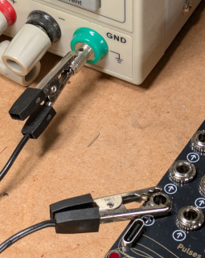

# AM Coupler

*AM Coupler* is a card that allows audio from the Workshop System to be received by an AM radio.

AM Coupler generates a radio frequency (RF) carrier wave in the Medium Wave band (530–1600kHz) and modulates this with an audio signal.

Because the output jacks of the Computer are not designed to generate frequencies much higher than audio, the RF output is generated on one of the debug connections, next to the LEDs on the Computer PCB. A short length of insulated wire connected to this and held next to to the antenna of an AM radio receiver, will, with some tuning, transfer the sound to the radio.

The RF output of this card is a simple unfiltered PWM signal, containing appreciable harmonics up to several hundred MHz, which can be radiated very effectively by a short piece of  wire. **This card therefore has the potential to broadcast radio interference over a wide range of frequencies.**  Additional filtering and attenuation may well be needed to ensure that radio emissions are within legal limits.

### Hardware requirements:

With a radio antenna very close to the bottom-left corner of the Workshop System, you may be able to pick up signals with no additional hardware. Most likely, a short length of wire will be needed, attached to the UART TX connection of the Workshop System Computer PCB. When attaching a wire to this, be extremely careful not to create a short between this and the the adjacent LED pin, as doing this and turning on power is likely to destroy the Computer module. I soldered a ~5cm wire with attached female pin header (blue wire in the photo below), to which a longer stretch of wire can be added when in use.

Depending on the power supply used, additional grounding of the Workshop System can reduce noise.

### Quick start:
1. Attach a ~50cm wire to the UART TX pin as detailed above, and place this immediately adjacent to the antenna of a radio set to receive Medium Wave. Tune the radio so that is 'between stations'.
2. Plug an audio signal (from one of the SineSquare oscillators, say) into Audio Input 1, and move the switch to the up position to turn on the radio signal. 
3. Use Main Knob to adjust the transmitted frequency, until you hear something on the radio

### Controls:

* **Switch + Pulse In 1:** RF carrier on/off
    * Middle position: RF carrier off
    * Top or bottom position: RF carrier on
        * If there is jack in Pulse In 1, then the RF carrier is turned on only when Pulse In 1 is high. 
* **Main Knob:** Coarse RF carrier tuning, roughly from 530–1600kHz
* **Knob X + CV input 1:** Fine RF carrier tuning, over roughly 25kHz
* **Knob Y:** Broadcast volume (carrier modulation amount)
* **Audio inputs 1 & 2**: Mixed to provide the RF modulator signal. 
    * If no jack is connected to either input, then a stored WAV file is used as the RF modulator (see below).
* **Audio output 1**: Outputs the stored WAV file (regardless of whether there are jacks in the audio inputs)
* **Audio output 2**: Outputs the modulation signal

* **Top left LED:** lit to indicate RF carrier on
* **Right LEDs:** three LEDs show 'VU meter' for carrier modulation amount

### WAV file playback:
This card supports storage and playback of a WAV file, using the same interface as the `sample_upload` example of ComputerCard. If no jack is connected to either audio input, then the WAV file is used as the modulator signal. 

### Tips:

* It is intended that the antenna of the radio receiver is immediately adjacent to the Workshop System. Transmission range and audio quality is highly dependent on conditions, antenna length and position, and frequency. I've generally found higher frequencies give longer range - up to a couple of metres with a 50cm wire attached to the Workshop System and a cheap radio receiver. Without appropriate filtering, broadband interference of radio signals propagates much further and is easily detectable 10m away.
* The main knob covers a similar range to the MW band on a radio receiver (530–1600kHz). If the main knob is near its anticlockwise stop, make sure the receiver is tuned to the fundamental frequency, and not its first (or even second) harmonic, which will also be towards the upper and of the MW band. 
