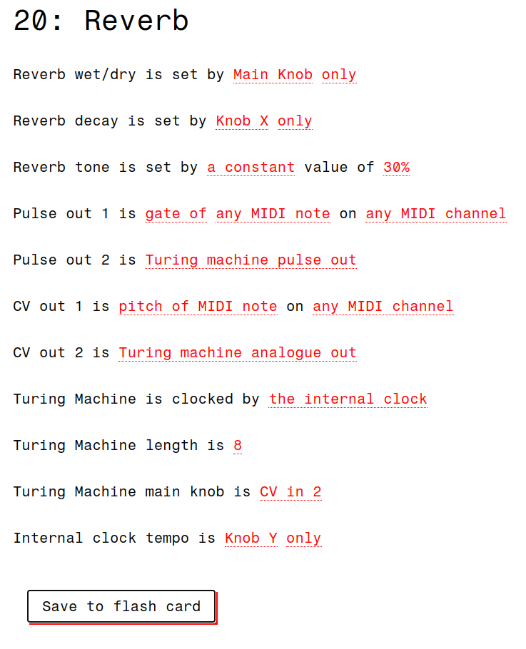

# reverb

A simple reverb (on audio inputs/outputs) **plus** configurable MIDI interface / clock / Turing machine / bernoulli gate ( on CV / pulses inputs/outputs), for Music Thing Workshop System Computer.

Reverb algorithm is that in the [Dattorro paper](https://ccrma.stanford.edu/~dattorro/EffectDesignPart1.pdf) (J. Audio Eng. Soc., **45**(9), 1997, 660&ndash;684), modified to damp either high or low frequencies in the reverb tail.

## Panel interface:
The panel interface is configurable from a computer using the file `reverb.html` in the repository. Load this page in a browser that supports Web MIDI, such as Google Chrome.

The editing interface allows control over which knobs and CV inputs control which parameters, and the arrangement of MIDI events, clock and Turing Machine outputs that appear on the CV and gate outputs.

Audio inputs are summed into the reverb input. Audio input 2 is inverting. Audio outputs are left/right channels of the combined wet+dry reverb output.

Left three LEDs show a 'VU meter' of the wet reverb output. To minimise noise and clipping, use input levels such that the bottom four LEDs are mostly lit and the top two mostly unlit. Top right LED shows input clipping.

Middle right LED shows pulse 1 output, bottom right LED shows pulse 2 output. 

## Use:

A `uf2` file is included in the `build` directory.

#### Compiling from source

The source is in C, using the Raspberry Pi Pico SDK. To compile:

1. Copy the custom board definition `mtm_computer_16mb.h` to `<path_to_pico_sdk>/src/boards/include/boards/`. 

2. Set up the environment variable defining the path to the Pico SDK, e.g.:
    `export PICO_SDK_PATH=<path_to_pico_sdk>`
	or equivalent for your shell.
    
3. Change to `20_reverb/` directory

4. Make and build in the usual way for the Pico SDK:

    mkdir build
    cd build
    cmake ..
    make
    

(The custom board definition  defines `#define PICO_XOSC_STARTUP_DELAY_MULTIPLIER 64`,  often needed for the RP2040 to startup).
   
   
   
----

Author: [Chris Johnson](https://github.com/chrisgjohnson)

Reverb DSP derived from code by [Pauli Pölkki](https://github.com/el-visio/dattorro-verb ) 
