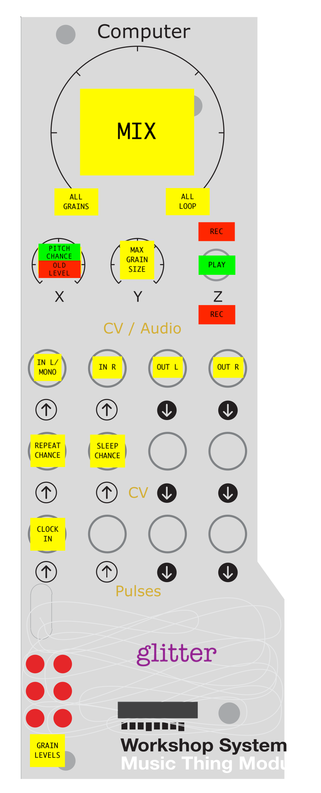

# Glitter

A two second sampler with stereo granulated playback for the Music Thing Modular Workshop System Computer.

## Video manual

https://youtu.be/JW8Z_I-ub2A

## Latest Release

https://github.com/sdrjones/mtws/releases/tag/glitter_v0.1.2-beta

## Source repo

https://github.com/sdrjones/mtws/tree/main/53_glitter

## Note

Glitter runs at a 192MHz clock speed. This is slightly less than the maximum supported clock speed in Pico
SDK 2.1.1 but in previous SDKs it would have been considered to be overclocked. If you want to run at a lower
clock speed without clicks then you would need to reduce the maximum number of grains and rebuild the code.

## Summary

* The loop is always playing. It will record the audio from the inputs when the switch is up or down.

* Up to six grains are playing small random snippets of the loop. Their behaviour can be affected by the X/Y knobs and CV inputs, but they can't be completely controlled.

## Cheat Sheet

## Controls

**Z Switch**: Switch up or down to record to the loop.

The "Up" position is a useful hands-free continual record mode in which the grains will play back snippets
from the previous two recorded seconds.

The "Down" position is good for punch in/out style recording. e.g. patch one oscillator's output to
the left audio input, and the other oscillator's output to the right input. Pick a couple of frequencies
and flick the X switch down. A brief snippet of the output will be recorded to the loop, overwriting what
was there before. Rinse and repeat.

NB. There is no dry or monitor output from glitter but you could patch that using stackables.

---

**Main Knob**: Fade between the plain loop (fully clockwise) and the granulated output (fully anti-clockwise).

---

**X Knob (In Play)**: Modify the chance of grains playing back at a different pitch. Chance of octave variations increases from fully anti-clockwise to half way. Chance of fifth variations increases from half way to fully clockwise.

NB grains will only re-pitch if they can safely do so without tripping over the write head, so at longer lengths there won't be as much re-pitching.

**X Knob (In Record)**: Adjust the mix between existing signal and new signal. Fully anti-clockwise is all
new signal, fully clockwise is all old signal.

---

**Y Knob**: Modify the maximum grain size. Clockwise is longer, anti-clockwise is shorter.

---

**CV1 in**: Modify the chance of the grains repeating themselves. Chance is maximum at 0V and decreases with
more positive voltage.

---

**CV2 in**: Modify the chance of the grains going to sleep.  Chance is maximum at 0V and decreases with
more positive voltage.

---

**Pulse 1 in**: With a steady clock input the grains' length and position shall be roughly quantised.

---

**LEDs**: Each LED shows the current level of a grain's output. Six LEDs, six grains - nice!

## FAQ

- The switch is up but I can't hear audio going to my loop - what's wrong?
  - Check that the X Knob is not fully clockwise. In this position the mix of audio going to the loop is 100% existing vs 0% new. The idea of coding it this way is that when the knob is rolled back from this position slightly you can get nice long fade outs of the loop.

## Credits

Thanks to Tom Whitwell for the amazing Music Thing Modular Workshop System.

Thanks to Chris Johnson for the excellent Utility-Pair examples.

Thanks to Dune Desormeaux, Brian Dorsey and the whole community of computer card creators whose work inspired me to have a go at this.
